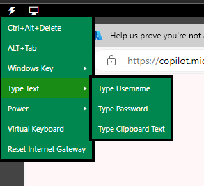
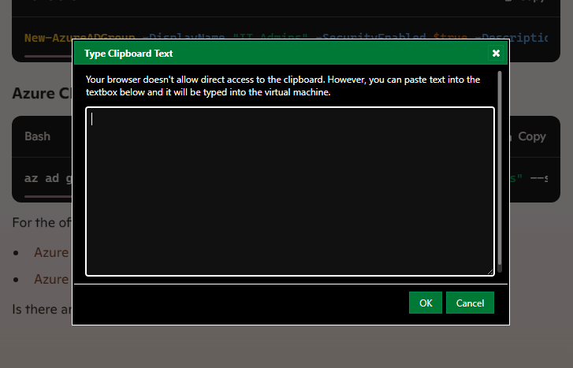

# AZ-104 - Day 0 (Orientation)
**Instructor:** Greg Lojek
 
**MS Teams Meeting link:** https://tinyurl.com/368f25nz

**Lessons start time:** 08:00

## Test Day
AZ-104 Thursday 12:00-13:00~
 
AZ-305 - Sunday 12:00-13:00~

## Decision cutoffs for if you want to take your exam
Scan the exam booking confirmation QR code found by the classroom door and fill in the details. This ideally needs to be done before midday.
- AZ-104 - Wednesday
- AZ-305 - Saturday (If you have passed AZ-104). You can book your AZ-104 test for this session if you'd like.

If you have not taken 2 exams during the training there is a QR code on Firebrand receptions you can scan to obtain your Microsoft test voucher.

## Tips
- You need to know both the PowerShell & CLI/Bash ways of using the command line. You do not need to know every command, just generally how to use it and to be able to spot obvious syntax errors.
- **Read the question thoroughly**. Some questions are worded to trip you up if you speed read them.
- If the exam once oe answer but two answers are correct. Check there are no requirements in the question that make an option invalid. If there is not always opt for the cheapest.
- Sometimes a future question can provide the answer or a strong hint to a previous question.
- **Watch out for the scrollbar**. Sometimes the scrollbar is not clear and you could miss a additional answer option as it is out of view and you didn't know it was there.

## Training Schedule
- Monday
  - Identity
  - Governance
  - Azure Resource Manager
- Tuesday
  - Networks
- Wednesday
  - Storage
  - Virtual Machines
  - Admin PaaS
  - Data Protection & Monitoring
- Thursday
  - Backups
  - Final exam prep
  - Exam

## SkillUp Labs

URL: https://firebrand-uk.learnondemand.net/Class/645637
 
Username: Deloitte Email
 
Password: Pa$$w0rd

- Labs are valid for 6 months.
- You have a limited number of attempts
  - 10 for a normal lab
  - 5 for a challenge lab
- Each session has an expiration time so keep an eye on the timer. When the expiration time nears a popup warning will be displayed on the instructions pane with an option to extend your session by 15 mins if needed (This can only be done once).
- Labs can not be saved midway through, you either have to finish it or abandon it.

In the instructions tab, tick off the steps as you go. This updates the percentage complete bar at the bottom and also acts as a bookmark should you need to reload.

The cleanup resources task at the end ony need to be followed if you are using your own subscription, if you are using the labs temporary subscription you can ignore this as the resources will be scrubbed when you leave the lab.

It is not possible to copy cut or paste using the conventional methods. If you need to copy or paste, you can click on the lightning bolt select `Type Text > Type Clipboard Text` this will then open a dialog box you can paste information outside of the VM session into. 

**Confirm in teams meeting chat when you have completed the lab so the instructor can keep track of who has finished**

### Troubleshooting issues
- If you get a dropout/if the remote session hangs, there is a button at the top left with a reconnect option. This will refresh the RDP connection.
- If there is no Internet access then click the lightning logo and then click `Reset Internet Gateway`.
- If it totally fails/doesn't work contact support on the portal to log the issue. They will refund the attempt it it can not be remedied