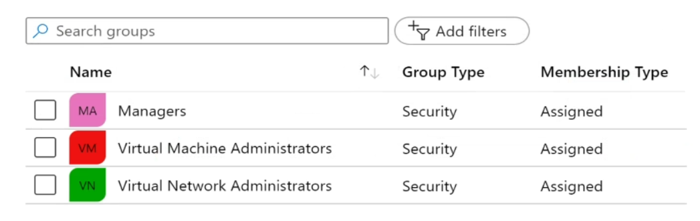

# AZ-104 - Day 0 (Identity, Governance & Compliance, and Azure Resource Manager (ARM))
## Identity

## Administer Identity with Entra

### Benefits & Features
- A cloud-based suite of identity managemetn capabiliteis that enables you to securely manage access to Azure services and resources for your users
- Provides application management, authentication, device management and hybrid identity

**Q:** What is the difference between Office 365 and Microsoft 365? 
**A:** There are lots of differences such as:
- Information protection plans.
- **Different Entra plans**.
- Intune is not in Office 365.
- Threat protection.
- Data lifecycle management.
- Insider risk management
- Microsoft Purview
  - Adaptive Protection.

[A full breakdown of differences can be found here 📎](https://go.microsoft.com/fwlink/?linkid=2139145&clcid=0x409&culture=en-us&country=us)

For this course the biggest differences we need to consider is: in Office 365 you pay for all the licenses you have purchased wether they are assigned/in user or not. In Microsoft 365 you pay by usage.

They also have different Entra Plans:
- Plan 1 (E3)
- Plan 2 (E5)

#### Key Differences Between Entra Plan 1 & Plan 2

The key differences between **Microsoft Entra Plan 1 (formerly Azure Active Directory P1)** and **Microsoft Entra Plan 2 (formerly Azure Active Directory P2)** primarily revolve around the advanced features and capabilities they offer. Here's a comparison:

| Feature | Entra Plan 1 (P1) | Entra Plan 2 (P2) |
|---------|-------------------|-------------------|
| **Conditional Access** | Yes | Yes |
| **Role-Based Access Control (RBAC)** | Yes | Yes |
| **Advanced Group Management** | Yes | Yes |
| **Cross-Tenant Synchronization** | Yes | Yes |
| **Session Lifetime Management** | Yes | Yes |
| **Global Password Protection** | Yes | Yes |
| **Identity Protection** | No | Yes |
| **Risk-Based Conditional Access** | No | Yes |
| **Privileged Identity Management** | No | Yes |
| **Access Reviews** | No | Yes |
| **Application Insights** | No | Yes |
| **Audit Logs** | Limited | Comprehensive |

**Entra Plan 1** is suitable for organizations looking for a robust identity management solution with essential features like conditional access, RBAC, and advanced group management.

**Entra Plan 2**, on the other hand, is designed for organizations with more advanced security needs and regulatory requirements. It includes all the features of Plan 1, plus additional capabilities like identity protection, risk-based conditional access, privileged identity management, access reviews, application insights, and comprehensive audit logs.

#### Useful links
[Microsoft product name changes 📎](https://m365maps.com/renames.htm)

[Differences between Microsoft 365 Apps for Enterprise and Office 2019 📎](https://learn.microsoft.com/en-us/archive/technet-wiki/52127.office-365-proplus-and-office-2019-comparison)

### What is a Domain Controller (DC)?

In it's rawest form it is:
- A Database
- A important folder called (SYSVOL)

It is responsible for the 5 A's:
- Authentication
- Authorization
- Accounting
- Auditing
- Administration

Strictly speaking user@domain.com is a UPN (User Principal Name) Although they look like email addresses they can only be considered as one if if linked to exchange (or another mail service provider)

#### Some Acronyms and buzz words that can come up
- **UPN:** User Principal Name - e.g. user@domain.com - *Note this looks like an email address but can only truly can be considered so if it is linked to exchange or another mail service provider*
- **SIP:** Session initiation protocol - A signaling protocol used for initiating, maintaining, and terminating communication sessions
- **DNS** Domain Name System - A server that translates domain names (like example.com) into IP addresses (like 192.0.2.1), making it possible for devices to find and communicate with each other, both on the internet and within private networks.
- **DMZ** Demilitarized Zone: a secure network segment that acts as a buffer between a private internal network and the untrusted external network (like the internet). It hosts public-facing services while keeping the internal network protected.
- **Win32 apps:** An application that is designed to run on the Windows operating system using the Win32 API.

In a on-prem only domain you can have internal top level domains (TLD) *.local, .intranet etc...* These domains are not globally routable (if you were yo use a .local name outside of the on-premise ecosystem it would not resolve back to your intend address). In Entra we must use globally routable domains (.com, .edu, .co.uk, .org etc...)

In traditional on-prem only setups we would have a DNS server on the DC which would be used to resolve internal domain addresses internal and then another DNS server in the DMZ to resolve external names.

When shifting to a hybrid cloud model every effort to eliminate local domains should be made. We then end up in a state where the Internal DNS can route private traffic and the DMS DNS server Routing public traffic using the same routable names. This is known as Split Brain/Horizon DNS.

In Active Directory (AD) the authentication services are:
- Kerberos
- NTLM (NT LAN Manager)

In Entra we have different protocols for authentication:
- SAML (Security Assertion Markup Language)
- OAuth
- OIDC (OpenID Connect)
- WS-Fed (Web Services Federation)

The reason we have so many different protocols in Entra is because of the way cloud distributes the data and services.

### Entra ID Concepts
- Identity: An object that can be authenticated
- Account: And identity that has data associated with it
- Microsoft Entra ID account: An identity created through Microsoft Entra ID or another Microsoft cloud service
- Tenant/directory: A dedicated and trusted instance. A tenant is automatically created when your organisation signs up for Microsoft cloud service subscription
  - Additional instances can be created
  - Microsoft Entra ID is the underlying product providing identity services
  - The term Tenant means a single instance representing a single organisation
  - The terms Tenant and Directory are often used interchangeably
- Azure Subscription: Used to pay for Azure cloud services

### Compare Entra ID (EidDS) to Active Directory Domain Services (ADDS)
- Entra Id is primarily an identity solution
- Queried using REST APIs over HTTP and HTTPS
- Uses HTTP/S protocols such as SAML, WS-Fed and OpenID Connect for authentication (and OAuth for authorisation)
- Includes federation service, and many third-party services (such as Facebook, Apple etc.).
- Entra ID users and groups are created in a flat structure, and there are no Organisational units (OUs) or Group Policy Objects (GPOs).

> That last point means little to somone who has not managed Active Directory or worked with it before. Details on what it actually means:
> #### Flat Structure in Entra ID
> In Entra ID (formerly known as Azure AD), **users and groups are organized in a flat structure**. This means that:
> - **No Hierarchy**: There's no nested hierarchy like in traditional on-premises Active Directory (AD). All users and groups are on the same level, kind of like files in a single folder.
> - **Simplified Management**: This flat structure simplifies user and group management but might require more creative ways to structure permissions and policies.
>
> #### No Organizational Units (OUs)
> - **Organizational Units (OUs)**: In traditional AD, OUs are used to create a hierarchical structure for organizing users, groups, and computers. They can be nested and are helpful for applying policies and delegating administrative control.
> - **Entra ID**: Does not use OUs. All users and groups exist in a single, flat namespace, without sub-containers or child objects.
>
> #### No Group Policy Objects (GPOs)
> - **Group Policy Objects (GPOs)**: In traditional AD, GPOs are used to apply specific configurations and policies to users and computers within OUs.
> - **Entra ID**: Does not use GPOs. Instead, configuration and policies are managed through **Intune** and **Conditional Access Policies**.

So we have:
- Active Directory (AD) And Active Directory Domain Services: For on prem.
- EntraID = Cloud Only
- AD & EntraID Connected via **Entra Connect** for syncing between the two: Hybrid
- EntraId Domain Services = Cloud that needs to support apps that depend on legacy protocols (EIDDS is a PaaS)

### Entra Billing and Some of it's concepts
[Entra ID Pricing 📎](https://www.apps4rent.com/azure-active-directory-pricing.html)

Delegate Group Creation Permissions: This allows you to assign a permissions to a security groups that can grant or deny Users the ability to create and maintain their own security groups, this lightens the administrative tasks on network admins.

Dynamic Group Creation - Allows you to create groups that are based on rules rather than being manually managed. these can be groups of users, devices or service principals. For example you could have a registered devices group for Android and another ofr Apple. You can drive this dynamically to help with intune management or a all managers group that uses a tag on the users account.

Conditional Access Policies - Rules in which Users, Devices or Applications have to satisfy to be able to connect.

Identity Protection and Governance Features **only in EntraId Plan 2**
This includes:
- Conditional Access Policies for Risks: Behavioral rule customisation, for example you can have rules like if user has moved locations from outside of the norm for example they have login attempt in UK, then Paris then New York in quick sucession you can pick at which point to fire the additional security check via MFA or take other actions, or you can have IP range checks and many other options.
- Entitlement Management: Design workflows to decide what happens after x amount of time/promotion of users.
- Privileged Identity Management (PIM): Eligible users can activate certain elevated roles for x amount of time rather than these users being permanently on elevated ids. *A similar concept to how we run things as administrator and have to fill in the box before we can run our task and once it finishes we're back to normal*
- Access Reviewing: User, Device and Application Snapshot of our organisation (usually monthly), helps for monitoring of user's behavior, access and a lot of other options to help with maintenance of roles, groups and threat spotting.

### Configure Device Entities
#### Registered Devices
- Supports Bring Your Own Device
- Registered devices sign-in using a Microsoft account
- Attached to an account granting access to resources
- Control using Mobile Device Management (MDM) tools like Microsoft Intune
- OS - Windows 10+, iOS, Android and MacOS
#### Joined devices
- Intended for cloud-first or cloud-only organisations
- Organisation owned devices
- Joined only to Azure - organisation account required
- Can use Conditional Access Policies
- OS - Windows 10+ devices
#### Hybrid Joined Devices
- You have Win32 apps deployed to these devices
- You want to continue to use Group Policy to manage the device
- You want to use existing image solutions to deploy services
- OS - Windows 7+ devices

### Implement Self-Service Password Reset (SSPR)
Microsoft now recommends having passwords that never expire: This is because studies have shown that enforcing the password expires after x days rule actually results in weaker passwords. Using things like Multi Factor Authentication (MFA) and Conditional Access Policy are far more robust and mean that expiring passwords is a lot less necessary. You need to be On Entra ID  Plan 1 (P1) or Plan 2 (P2) to access the SSPR feature.

#### Steps
1. Determine who can use self-service password reset
2. Chose the number of authentication methods required and the methods available (email, phone, questions etc.)
3. You can make it so users are required to register for SSPR before continuing (same process as with MFA)

### Configure User and Group Accounts
#### Create User Accounts
- All users must have an account
- The account is used for authentication and authorization
- Each users account has additional properties

#### Manage User Accounts
- Must be Global Administrator or User Administrator to manage users
- User Profile (Picture, job, contact info) is optional
- Deleted users can be restored for 30 days
- Sign in and audit log information is available

#### Performing Bulk Account Updates

- Supports bulk user and group member updates
- Create a comma-separated values (CSV) template you can download from the portal.
- Must be a Global Administrator or User Administrator

#### Get User PowerShell
- Get MsolUser - Microsoft 365 Users*
- Get-AZADUser - Users in Azure*
- Get-AzureADUser - EntraId*
- Get-MGUser - MG Graph (recommended for user functions going forward)

*Deprecated

*Note: All of these methods use different way's of managing the passing of the password to the command.*

[If you want to learn more about PowerShell in Azure check the course material for **AZ-040 - Automating Administration with PowerShell**](https://learn.microsoft.com/en-us/training/courses/az-040t00)

#### Create Group Accounts
Group Types:
- Security groups
- Microsoft 365 groups

Assignment Types:
- Assigned
- Dynamic Users
- Dynamic Device (security groups only)

#### On Prem Group to Entra Group Translation

#### On-prem Groups
- **Global Groups:** Groups users and devices, and can be used in any domain within the forest for assigning permissions.
- **Domain Local Groups:** Group resources (like files, printers) within a single domain, and assign permissions to these groups.
- **Universal Groups:** Combine users, devices, and resources across all domains in a forest, useful for assigning permissions throughout the forest.

#### Entra ID Groups
- **Security Groups**: Similar to Global Groups and Domain Local Groups, these are used to manage access to resources and applications.
- **Microsoft 365 Groups**: Similar to Universal Groups, these are used for collaboration purposes, integrating with services like Microsoft Teams, SharePoint, and Outlook.

#### User Permission Models
> **On-prem**
> 
> Account > Global Group > Domain Local > Permission

> **Entra Id**
> 
> Identity > Groups > Sharepoint/Teams Groups > Access Control

### Assign Licenses to Users and Groups
#### Azure is a cloud service that provides many built-in services for free:
- Microsoft Entra ID comes as a free service
- Gain additional functionality with a P1 or P2 license

#### Additional Services (Like O365 are paid cloud services):
- Microsoft paid cloud services require licenses
- Licenses are assigned to those who need access to the services
- Each user or group requires a separate paid license
- Administrators use management portals and PowerShell cmdlets to manage licenses

### Administrative Units
An **administrative unit** in Microsoft Entra ID is a container for organizing users, groups, or devices within your organization. It allows you to **delegate administrative permissions** to specific users or groups for managing only the members within that unit. This helps in restricting permissions and simplifying management, especially in large organizations with multiple divisions or regions.

For example, you could create an administrative unit for the "Marketing" department and assign a regional support specialist to manage users only in that department.
#### Steps To create Administrative Units
1. Create an administrative unit
2. Populate the administrative unit with users or groups
3. Create a role whi appropriate permissions scoped to the administrative unit
4. Add IT members to the role

*You got to here when reviewing your notes*
### Entra ID Connect

Entra ID Connect is used for connecting (Syncing) AD with Entra ID
You can install it on a domain controller but it is not recommended, you should use a different app server for it.

On-prem instance of Active Directory is considered the 'master' and it generally works on a 30 min sync (you can force a sync via PowerShell).

AD is a repository of classes and attributes.

If certain things occur where AD does not have a schema for a app but they do exist in Entra you can get issues where you can't push attributes that are not in AD. These can be pushed to Entra via PowerShell scripts

#### Authenticating Users connection via Entra
In a hybrid scenario it is possible password policies can differ between AD and Entra Id:

**Password Hash Synchronization (PHS)** is the option that alow the sync of passwords. The default config is to have this enabled. Password hash sync is within 2 mins.

If you are on Entra Id Plan 1 you can enable password writeback. This means you can enable PSSR on Entra and write the password changes back to on-prem AD. Groups and devices can also be written back as part of the writeback options in Plan 1.

Entra Id Plan 1 also contains Entra Identity Protection which includes a feature called Leaked Credentials. This feature takes the Password hashes it has for users and 'scans' multiple dubious sites and databases to see if any password hashes have been compromised.

*You got to here when reviewing your notes*
**Passthrough Authentication (PTA)**
This means only Entra ID is used stored in the sync. An agent will be installed in the local AD (minimum of 3 is recommended). When a user wants to sign in they credentials end up on a secure Entra queue a secure connection is obtained between Entra and the Entra-agent and it then authenticates them.

4 status that a authentication result can be
False, True, Expired & Locked out

You can't do Leaked Credentials on a PTA instance as the hashes are not stored to check.

Disadvantage is that if the connection is broken users can not authenticate.
Advantage is that no credentials are stored elsewhere.

**Federated ID**
Requires a federation server/service - responsible for authenticated federation ids with AD.
Requires a service between the Internet and Domain. WAP (Web Application Proxy)

User > Internet > WAP > Federation Service > Domain Controller

Disadvantages
- Cost
  - Requires additional licenses for Federation and Proxy services. Needs to be highly available so more than one instance
  - Fault Domain: In virtualization it's where we deploy multiple services on separate VMs on the same box. So to protect against this you need more than one physical server to remove single point of failure.
  - Additional connections
- Complexity

Advantages
- Create trusts between different federation servers (for example in a partnership) meaning that users can sign into domain 1 using credentials for domain 2 rather than having multiple sets of credentials.
- Use of third party federations like Google, facebook etc to authenticate with these credentials rather than needing explicit ones.
- Supports SSO

There are two type of Entra syncs (https://learn.microsoft.com/en-us/entra/identity/hybrid/cloud-sync/what-is-cloud-sync)

- Connect Sync: is the full sync option
- Cloud Sync: Uses lightweight agent and the engine runs in azure, doesn't support pass through, device types and a few other things.

**Administration Unit Definition**
An Administration unit refers to a team or department within an organization that manages and oversees the implementation, management, and monitoring of Microsoft Azure services. This unit is responsible for ensuring that the Azure environment is configured, secured, and optimized to meet the organization's needs.

**Entra User Types Definitions**
Microsoft Entra (formerly known as Azure Active Directory) has different user types to manage access and permissions. Here are the main user types you should be familiar with:

Member Users: These are internal users within your organization. They have full access to all resources and services within the organization's directory1.

Guest Users: These are external users from other organizations or identity providers. They have limited access compared to member users and are often used for collaboration purposes1.

External Members: Similar to guest users, but with member-level access to resources in your organization. This is common in multi-tenant environments1.

Service Principals: These are non-human identities used by applications or services to access resources in Entra. They are often used for automated processes and integrations.

#### Governance & Compliance
**Regions**
- A region represents a collection of datacentres
- Provides flexibility and scale
- Preserves data residency
- Select regions close to your users
- Be aware of region deployment availability
- There are global services that are region independent
- Regions are paired for high availability

Not every service is available in every region.
Useful site to see and compare service availability across regions (https://azurecharts.com/regions)

SLAs (https://azurecharts.com/sla)

Azure Latency Test (https://www.azurespeed.com/Azure/Latency)

Availability zones, number of data centres (capped at 3, if more data centres in the reason you will only see 3 in the documentation) within the region. At least 300 miles apart.

Azure Datacentre globe (https://datacenters.microsoft.com/globe/)

Azure Pricing Calculator (https://azure.microsoft.com/en-gb/pricing/calculator)

**Prices of resources varies by region**

There are options to make a price cheaper like Saving plans if you commit to a spend, reservations if you need 24/7 uptime.
You also have the option to use Azure Hybrid benefit which alow you to use licenses you already own rather than purchasing the license in the price.

Implement Azure Subscriptions
- Only identities in Azure AD, or a directory that is trusted by Azure AD, can create subscriptions
- Logical unit of Azure services that is linked to an Azure account
- Security & billing boundary*

Most Common Subscription types:
- Free: Includes a $200 credit for the first 30 days, free limited access thereafter for 12 months.
- Pay-as-you-go: Charges you monthly
- CSP: Agreement with possible discounts through a Microsoft Cloud Solutions Provider Partner - typically for small to medium businesses
- Enterprise: One agreement, with discount for new licenses and Software Assurance - targeted at enterprise-scale organisations
- Student: Includes $100 for 12 months - Mist verify student access

Full list (https://azure.microsoft.com/en-us/support/legal/offer-details/?msockid=39d2d407474064f71006c12a463f657f)

Microsoft advisor will make recommendations to help save costs. It also makes reliability and other type of recommendations.

**Manage Costs**
- Costs are resource-specific
- Usage costs vary between locations
- Costs for inbound and outbound data transfers differ
- Pre-pay with Azure reserved instances.
- Use your on-premises licenses with Azure hybrid Benefit
- Optimise with alerts, budgets and Azure Advisor recommendations

**Determine Service Limits & Quotas**
- Resources have a default limit (A subscription quota)
- Helpful to track current usage, and plan for future use
- You can open a free support case to increase limits to published maximums

Azure offers something called a spot discount with options to evict a resource if the capacity in the region is exceeded or if a cost quota set has been exceeded.

**Management Groups**
- Management groups provide a level of scope **above** subscriptions
- Target policies and spend budgets across subscriptions and inheritance down the hierarchies
- Implement compliance and cost reporting by organization (business/teams)

*To prevent changes, apply resource locks at the subscription, resource group, or resources level.

Root Management Group > Management Group/Subscription, and so on... (Up to 6 levels below root (7 in total))

Due to the nature of them being used to manage subscriptions they do not make sense if you only have one subscription.

**Review Resource Manager Benefits**
- Provides a consistent management level
- Enables you to work with the resources in your solution as a group
- Deploy update or delete in a single, coordinated operation
- Provides security, auditing, and tagging features
- Choose the tools and APIs that work best for you

**Azure Resource Terminology**
- A Resource is simply a single service instance in Azure
- A Resource group is a logical grouping of resources
- An Azure Resource Manager template is a JSON file that allows you to declaratively describe a set of resources
- A declarative syntax is what a template uses to state what you intend to create
- A resource provider is a service that supplies the resource you can deploy and manage through Resource Manager

**Create Resource Groups**
- Resources can only exist in one group
- Groups can have resources of many different types (services) and form many different regions
- **Groups cannot be renamed or nested**
- You can move resources between groups

When you create a resource the first thing you will be asked is which resource group should the resource belong to. By default it will take the resource groups location but it can be different.

**Create Resource Manager Locks**
- Associate the lock with a subscription, resource group, or resources
- Locks are inherited by child resources
- Read-only lock prevent changes to the resources
- Delete locks prevent deletion

**Apply Resource Tags**
- Provides metadata for your Azure resources
- Logically organise resources
- Consists of name-value pair
- Very useful for rolling up billing information

#### Azure Policies

- A service to create, assign and manage policies
- Runs evaluation and scans for non-compliant resources
- Advantages:
  - Enforcement and compliance
  - Apply policies at scale
  - Remediation
- Use cases:
  - Allowed resource types - Specify the resource types that your organisation can deploy
  - Allowed virtual machine SKUs (Stocking units) - Specify a set of virtual machine SKUs that your organisation can deploy
  - Allowed locations - Restrict the locations your organisations can specify when deploying resources
  - Require tag and its value - Enforce a required tag and its value
  - Azure backup should be enabled for Virtual Machines - Audit if Azure Backup service is enabled for all Virtual machines

Policies generally start 5 mins after being applied and should take an hour but have 24 hours to evaluate.
Sometimes remediation tasks can solve policy compliance issues but in others it will need manual intervention

You can use policy initiatives to apply a group of policies as a package

#### Role Based Access Control (RBAC)
RBAC roles provide fine-grained access management

| Azure RBAC Roles | Azure AD roles |
| ---------------- | -------------- |
| Manage access to Azure resources | Manage access to Azure AD objects |
| Scope can be specified at multiple levels | Scope is at the tenant level |
| Role information can be accessed in the azure portal, Azure CLI, Azure Powershell, ARM templates, Rest API | Role information can be accessed in Azure portal, Microsoft 365 Admin portal, Microsoft Graph, Azure Active Directory, Powershell, Or Graph |

**Implement Role-Based Access Control**
- Provides fine-grained access management of resources in Azure
  - Buil on Azure Resource Manager
  - Segregate duties within your team
  - Grant only the amount of access that a user needs to perform their job
- Concepts
  - Security Principal - Object that represents something that is requesting access to resources.
  - Role definition - Collection of permissions that lists the operations that can be performed.
  - Scope - Boundary for the level of access that is requested.
  - Assignment - Attaching a role definition to a security principal at a particular scope:
    - Users can grant access described in a role definition by creating an assignment
    - Deny assignments are currently read-only and are set by Azure Blueprints and Azure Managed Apps

There are many built-in roles, or you can create your own custom role.
There are Actions and DataActions to alow granular configuration between a action to the resource and an action to the data within it.

**Default Azure RBAC Roles**
| RBAC role in Azure | Permissions | Notes |
| --------- | ----------- | --------|
| Owner | Has full access to all resources and can delegete access to others | The Service Administrator and Co-Administrators are assigned the Owner role ath the subscription scope. This applies to all resource types |
| Contributor | Creates and manages all types of Azure resources but cannot grant access to others | This applies to all resource types |
| Reader | View Azure resources | This applies to all resource types |
| User Access Administrator | Manages user access to Azure resources | This applies to managing access, rather than managing resources|

**Create a role assignment**
The process of binding a definition to a User, Group or Service Principal at a scope for the purpose of granting access.

### Configure Azure Resources
**Tools**
- Azure Portal
- Azure Cloud Shell
- PowerShell

PowerShell workflow is a feature introduced in PowerShell 3.0 that allows you to create long-running, persistent tasks that can run across multiple systems and recover from interruptions.

`Get-Module -ListAvailable`

Questions will be on most common used commands but most questions are fairly obvious rather than needing to know the command library.

**Using Cloud Shell**
- Interactive, browser-accessible shell
- Offers wither Bash or PowerShell
- Is temporary and provided on a per-session, per-user basis
- Requires a resource group, storage account, and Azure file share.
- Authenticates automatically
- Integrated grapghical text editior, accessed via a button at the top or the `code filename` command.
- Is assigned one machine per user account
- Times out after 20 minutes idle

**ARM Templates**
- Improves consistency and promotes reuse
- Reduce manual, error prone and repetitive tasks
- Express complex deployments
- Express requirements through code
- Provide validation tasks
- Modular and can be linked
- Simplifies orchestration

Link to quickstart templates (https://learn.microsoft.com/en-us/samples/browse/?expanded=azure&products=azure-resource-manager)

**Azure Bicep**
- Simpler syntax for writing templates
- Smaller module files you can reference from a main template
- Automatically detect dependencies between your resources
- VS Code extension with validation and InteliSense

You can **Decompile** Bicep into -> ARM JSON
'Compiled' Bicep is actually ARM JSON that is then processed through the Azure Resource Manager

