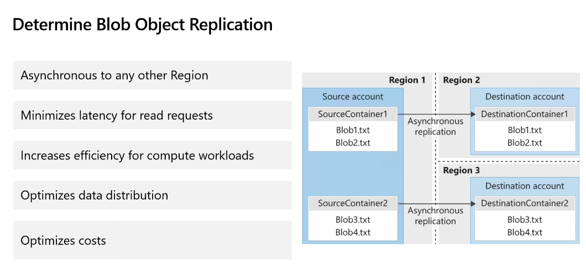
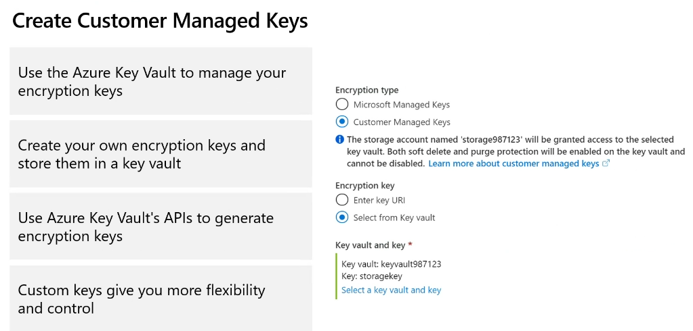
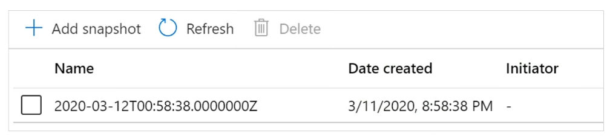

# AZ-104 - Day 3 (Storage)
## Storage
### Azure Storage
A service you can use to stor files, messages, tables and other types of information
- Durable, Secure, Scalable, Managed, Accessible
- Storage for:
  - Virtual machines
  - Unstructured data
  - Structured data
- Two tiers:
  - Premium
  - Standard

### Azure Storage Services
- Azure containers: A massively salable object store for text and binary data
- Azure Tables: Ideal for storing structured, non-relation data
- Azure Queues: A messaging store for reliable messaging between application components. This is not guaranteed to be FIFO.
- Azure Files: Managed file shares for cloud or on-prem deployments

### Storage Account Kinds
- Standard general purpose v2: Most scenarios including:
  - Blob
  - file
  - queue
  - table
  - Data Lake Storage
- Premium block blobs: Block blob scenarios with high transaction rates or scenarios that use smaller objects or require consistently low storage latency
- Premium file shares: Enterprise or high-performance file share applications. If you need to use Linux NFS you need to use this premium option. 
- Premium page blobs: Premium high-performance page blob scenarios
- Append blob: For things like logs (not premium).

#### Block blob VS Page blob
**Block Blobs**
- Structure: Comprised of blocks, each identified by a Block ID. You can upload, download, and manage individual blocks within a blob.
- Use Cases: Ideal for storing text and binary data, such as documents, images, videos, backups, and logs.
- Size: Can store up to 5 TB of data.
- Performance: Optimized for large sequential read/write operations.

**Page Blobs**
- Structure: Made up of 512-byte pages. Each page can be read or written individually.
- Use Cases: Suitable for scenarios requiring frequent random read/write operations, like IaaS disks for VMs and database storage.
- Size: Can grow up to 8 TB in size.
- Performance: Optimized for random read/write operations, providing high performance and low latency.

***It is not possible to change a blob type once it has been created. You have to remove it and re-upload***

### Redundancy
Regions > Zones > Fault Domains (Availability sets)

- Local Redundancy Storage (LRS): 3 copies of the file across the 3 fault domains. **Cheapest**
- Zone redundant storage (ZRS): 3 copies across zones
- Geo Redundant Storage (GRS): 3 copies on a fault domain in one region and 3 copies in another region across it's fault domains too. **Default**
- Geo Zone Redundant Storage (GZRS) 3 copies across a regions zone plus additional 3 copies across another regions fault domains
- Read Access Geo redundant storage (RA-GRS): Same as GRS but reads can be made in the 2nd region.
- Read-Access Geo Zone Redundant Storage (RA-GZRS): Same as GZRS but with reads available in the other region

#### GiB vs GB
1 GiB is the rounded version - 1000
GB is the actual size - 1024

### Access Storage

You can use your own domain if you prefer but this has to be via  CNAME record (Alias to sub-domain target that directs to the Azure one). You have to manage all the certificates etc for your domain in this option. If you want to deliver everything from your domain URL you need a CDN (Content Delivery Network).

### Blob Storage
- Stores unstructured Data in the cloud
- Can store any type of text or binary data
- Also reffered to as Object storage
- Common uses:
  - Serving images oir documents to a browser
  - Storing files for distributed access

- All blobs must be in a container
- Accounts have unlimited containers
- Containers can have unlimited blobs
- Restric access using public access levels
  - Private (no anon access) **Default**
  - Blob (anon read access to blobs only)
  - Container (anon  read access to containers and blobs)

**You now have to alow anon access on the storage account config before you can set the anon options in the container**

It is best practice to segregate containers by access levels so that you can not share too much information with the wrong party.

### Access Tiers
- Hot: Data that is access or modified frequently **Default, default can be modified in the storage account config**
- Cool: Data that is infrequently accessed or modified and stored for at least 30 days
- Cold: Data that is infrequently accessed or modified and stored for at least 90 days
- Archive: Data that can tolerate several hours of retrieval latency (Data rehydration) and will remain in Archive tier for at least 180 days

*When rehydrating archived blobs you can set a priority of normal or high. High is more expensive.*

### Blob Lifecycle Management Rules
- Transitioning of blobs to a cooler storage tier to optimize performance and cost
- Delete blobs at end of lifecycle
- Apply rules to filtered paths in the storage account

### Blob Object Replication

### Blob security strategies

#### Shared Access Signatures (SAS)
- Provides delegate access to resources
- Grants access to clients without sharing your storage account keys
- The account SAS delegates access ti the resources in one or more storage services
- The service SAS delegates access to a resource in just one of the storage services

#### Azure stored access policies
Azure stored access policies provide an additional level of control over service-level shared access signatures (SAS) on the server side. They allow you to group shared access signatures and apply additional restrictions to those signatures1. Here are some key points about stored access policies:
- Control Over SAS: You can use stored access policies to change the start time, expiry time, or permissions for a SAS
- Grouping Signatures: They help group multiple SAS tokens under a single policy, making management easier.
- Revocation: You can revoke a SAS after it has been issued by modifying the stored access policy.
- Resource Support: Stored access policies are supported for blob containers, file shares, queues, and tables.
- Parameter Restrictions: You can't specify a parameter on both the SAS token and the stored access policy
  - If you set a parameter in the stored access policy, you cannot also set the same parameter in the individual SAS token
    - Instead, the parameter defined in the stored access policy will be applied to all SAS tokens associated with that policy.
    - For instance, if you define the expiry time in the stored access policy, you don't need to define it again in the SAS token. Doing so would result in an error because the SAS token inherits the policy's parameters.
    - This helps ensure consistent application of permissions and reduces the risk of conflicting settings.

#### Storage Service Encryption (SSE) a.k.a Azure Storage Service Encryption
- Protects your data for security and compliance
- Automatically encrypts and decrypts your data
- Encrypted through 256-bit AES encryption
- Is enabled for all new and existing storage accounts and cannot be disabled
- Is transparent to users

#### Customer Managed Keys

#### Storage Security Best Practices

### Azure Files
#### Compare Files to Blobs
**Files do not have retention policies**

#### Manage File Shares
- File Share quotas
- Windows - Ensure port 445 is open
- Linux - Mount the drive
- MacOS - Mount the drive
- Secure transfer required - SMB 3.0 Encryption

#### File Share Snapshots
- Incremental snapshot that captures the share state at a point in time
- Is Read-only copy of your data
- Snapshot at the file share level, and restore at the file level
- Protection against application error and data corruption
- Protection against accidental deletions or unintended changes
- General backup purposes

To automate snapshot taking use PowerShell scripting or a backup solution

#### File Sync Service

##### Legacy
 DFS - Distributed File System

 Instead of \\ServerName\Documents\etc...
 We get \\Namespace\Documents\etc...

 The namespace then looks up which file server to use to get the replicated contents of that directory\file

##### Azure file sync
Works the same but using cloud endpoints

##### SMB over QUIC
SMB over QUIC introduces an alternative to the TCP network transport, providing secure, reliable connectivity to edge file servers over untrusted networks like the Internet. QUIC is an IETF-standardized protocol with many benefits when compared with TCP

https://learn.microsoft.com/en-us/windows-server/storage/file-server/smb-over-quic?tabs=windows-admin-center%2Cwindows-admin-center1

#### Cloud tiering
Cloud tiering is an optional feature of Azure File Sync that helps reduce the amount of local storage required while maintaining the performance of an on-premises file server. When enabled, cloud tiering stores only frequently accessed (hot) files on your local server, while infrequently accessed (cool) files are split into namespace (file and folder structure) and file content1. The namespace is stored locally, and the file content is stored in an Azure file share in the cloud

### Storage with tools
- Azure Storage Explorer
- The Import Export service
- AzCopy (Superior to native copy cmdlets as it understands the metadata and flags specific to Azure)

## Virtual Machines
**Review Cloud Service Responsibilities**

### Plan Virtual Machines
- Start with a network
- Name the Virtual Machine
  - Azure Name (Resource Name)
  - Machine/Computer Name (e.g. DC1 or DNS2 etc...)
- Chose a location
  - Each region has different hardware and service capabilities
  - Locate Virtual Machine as close as possible to your users and to ensure compliance and legal obligations
- Consider pricing

### Virtual Machine Sizing

| Type | Description |
| ---- | ----------- |
| General purpose | Balanced CPU-to-memory ratio. |
| Compute optimised | xx |

### Family list
https://learn.microsoft.com/en-us/azure/virtual-machines/sizes/overview?tabs=breakdownseries%2Cgeneralsizelist%2Ccomputesizelist%2Cmemorysizelist%2Cstoragesizelist%2Cgpusizelist%2Cfpgasizelist%2Chpcsizelist

**Constrained/Exotic sizes**
Officially available but not recommended directly.

You can resize an existing VM but only within its current family

**Spot Virtual Machines**
insert def here

### Operating System
There are pages upon pages of operating systems available. You can also create your own byt getting your VM in the state you want and then using sys prep to generalise and then create an image with it.

### Azure Hybrid Benefit
Option that alow you to receive a discount on your VM by using an owned license rather than purchasing it along with the VM

### Default network security on a new VM
The default network settings on a new vm are: Outbound request is allowed. Inbound traffic is only allowed from within the virtual network.

### Managed Disks

When setting up a Virtual Machine (VM) in Azure, the **managed disk option** refers to using Azure-managed disks for your VM's storage needs. Managed disks are block-level storage volumes that are managed by Azure and can be used as OS disks or data disks for your VMs. Here are some key points about managed disks:

1. **Types of Managed Disks**: Azure offers several types of managed disks, including **Premium SSDs**, **Standard SSDs**, **Standard HDDs**, and **Ultra Disks**. Each type is designed to address specific performance and cost requirements.
2. **Automatic Management**: Azure handles the maintenance, replication, and backups of managed disks, reducing the administrative overhead.
3. **Scalability**: Managed disks can be easily scaled up or down based on your workload requirements.
4. **Redundancy Options**: You can choose between **Locally Redundant Storage (LRS)** and **Zone-Redundant Storage (ZRS)** for data redundancy and availability.
5. **Encryption**: Managed disks are encrypted by default using Azure Storage Service Encryption (SSE), ensuring data security at rest.

**Windows VMs have to use managed disks.**

### Proximity placement group
Proximity placement groups allow you to group Azure resources physically closer together in the same region, which helps on tasks where lots of communication during very large tasks is key.

### Virtual Machine Storage
Each Azure VM has to or more disks
- OS Disk
- Temporary disk (not all SKUs have one, content can be lost)
- Data Disk

OS and data disk reside in Azure Storage Accounts
- Azure-based storage service
- Standard (HDD, SDD) or Premium (SSD), or Ultra (SSD)

### Bastion
**Azure Bastion** is a fully managed service provided by Microsoft Azure that allows you to securely connect to your virtual machines (VMs) over Remote Desktop Protocol (RDP) and Secure Shell (SSH) without exposing them to the internet. Here are some key features of Azure Bastion:

1. **Secure Connectivity**: Azure Bastion provides secure and seamless RDP/SSH connectivity to your VMs directly over TLS from the Azure portal or via the native SSH or RDP client on your local computer.
2. **No Public IP Required**: Your VMs don't need a public IP address. Azure Bastion connects to your VMs using their private IP addresses.
3. **Single Click Access**: You can access RDP and SSH sessions directly in the Azure portal with a single click.
4. **Firewall Traversal**: Azure Bastion uses an HTML5-based web client that is automatically streamed to your local device, allowing RDP/SSH sessions over TLS on port 443.
5. **No Agent or Special Client Software**: There's no need for an agent on your VM or special client software.
6. **Protection Against Port Scanning**: Your VMs are protected against port scanning by malicious users since you don't need to expose RDP/SSH ports to the internet.
7. **Hardened Security**: Azure Bastion is a fully managed platform as a service (PaaS) that is hardened internally to provide secure RDP/SSH connectivity.

Azure Bastion simplifies the management of secure remote access to your VMs while enhancing security by eliminating the need for public IP addresses and reducing the attack surface.

**You can have only one Bastion instance per vNet**

#### Classic Approach

#### Privileged Access Machine

##### Double hop problem
The **double hop problem** occurs when a user's credentials need to be passed through multiple servers in a single session, but the credentials are not automatically forwarded beyond the first server. This often happens in environments where Kerberos authentication is used.

Here's a simplified explanation:
1. **First Hop**: The user logs into Server A using their credentials.
2. **Second Hop**: From Server A, the user tries to access resources on Server B. If Server A needs to authenticate to Server B on behalf of the user, the credentials need to be passed to Server B.
3. **Problem**: By default, Kerberos authentication does not pass the user's credentials beyond the first server (Server A), resulting in a "double hop" issue where Server B cannot authenticate the user.

To resolve this, you can use **Kerberos Constrained Delegation** or **CredSSP (Credential Security Support Provider)**, which allow credentials to be passed securely to additional servers.

#### Bastion Approach

Bastion can be quite expensive if the use case is to only have a few machines going. Cheaper options are Load Balancer, NAT gateway, or Just in-time access (part of defender for cloud).

### Connect to Windows VM
- Remote Desktop Protocol (RDP)
  - Creates a GUI session and accepts inbound traffic on TCP port 3389
- WinRM
  - Creates a command-line session so you can run scripts

### Connect to Linux VM

### Plan for Maintenance and Downtime

#### Availability Sets 

**Two or more instances in Availability Sets = 99.95% SLA**

https://www.azure.cn/en-us/support/sla/virtual-machines/

https://uptime.is/

#### Availability Zones

The Zone numbers are not persistent across subscriptions. What is zone 1 in one subscription could be zone 3 in another.

**99.99 SLA**

### Compare V to H Scaling

Vertical scaling machine plans will result in down-time

#### Scale sets
These are the rules you can set for automating scaling via conditional rules

**Spot machines are recommended for scale outs as they are cheaper and if suddenly the machine is required it will be deallocated but then if your scaleset rules are set to still need it a non-spot machine will be fired up for the duration it is needed**

### Virtual Machine Extensions

#### Customer Script Extensions

#### Desired State Configuration
- Configuration block(s) have a name
- Node blocks define the computers or VMs that you are configuring
- Resource block(s) configure the resource and its properties
- There are many built-in configuration resources
- Must execute withing 90 mins

https://github.com/Azure/azure-quickstart-templates/tree/master/application-workloads/active-directory/active-directory-new-domain

## PaaS Compute Options
### App Service Plans
- Determine performance, price and features
- defines a set of compute resources for a web app to run
  - Region
  - No of VM instances
  - Size of machines
  - Pricing
- One or more apps can be configured to run in the same ASP

#### Pricing
- Shared compute: (Free and Shared). Run apps on the same Azure VM as other App Services appsm and the resources can not scale out
- Dedicated compute: (Basic, Standard, Premium). Run apps in the same plan in dedicated Azure VMs
- Isolated: Runs apps on dedicated Azure VMs in dedicated Azure virtual network

#### ACU vs vCPU
ACU - Azure compute units.
the theory is similar to a DTU in databases, it is a calculation on cores, RAM, disk (size and speed) and other factors to get a number that is understandable.

#### Scale Up and Scale Out

### App Service
#### Implement Azure App Service

#### Create an App Service

### Deployment Slots
#### Create Deployment Slots

#### Add Deployment Slots

### Secure An App

### Custom Domains

### Backup

### Containers
#### Compare Containers to VMs

#### Monolith vs MicroService

### Azure Container Instances
- PaaS Service
- Faster startup times
- Public IP connectivity and DNS Names
- Isolation features
- Customer sizes
- Persistance storage
- Linux and Windows containers
- Co-scheduled Groups
- Virtual network Deployment

### Implement Container Groups

### Understand the Docker Platform (optional)

### Manage Containers with Azure Container Apps
- Alternative to Azure Kubernetes Service (AKS)
- Integrates with Azure Container Registry (ACR)
- Simplifies complex infrastructures
- Manages container orchestration

