# AZ-104 - Day 4 (Monitoring)
## Monitoring
### Backup
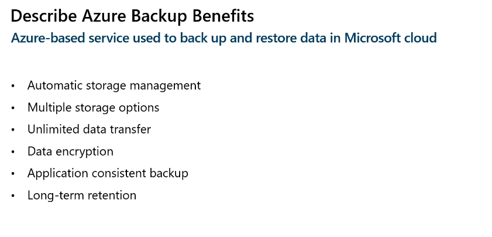
### Azure Backup Centre (New Product Business Continuity Center)
- Single pane of glass to manage backups across a large and distributes azure environments
- Datasource-centric management focused on what you are backing up
- Connected experiences with native integrations that enables management scale
**The new version covers both Iaas and PaaS (the old version only covered IaaS unless explicitly configured)**
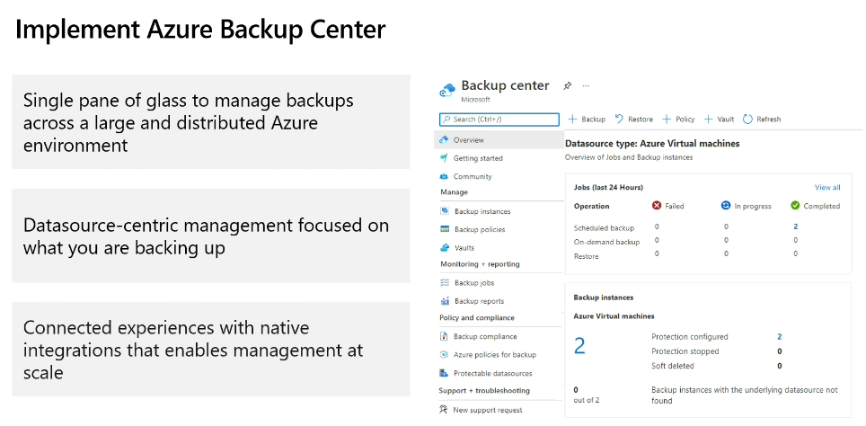
### Recovery Services Vault
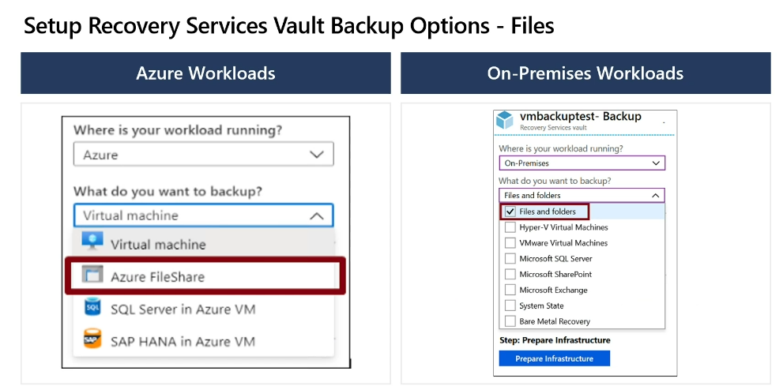
**Files use MARS - Microsoft Azure Recovery Service agent needs installing if on-prem files are being backed up to Azure**
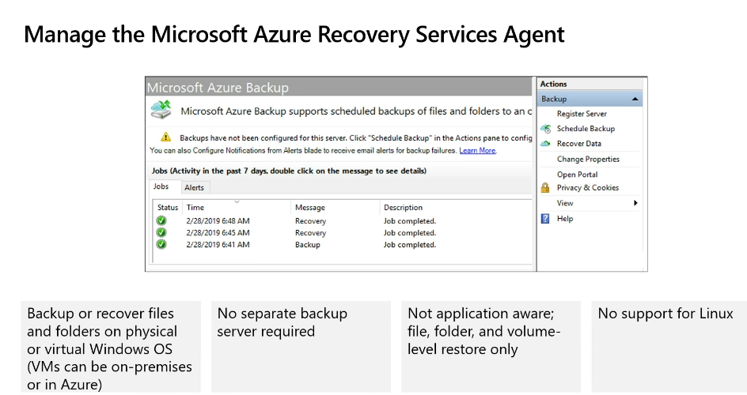
**Other types use MABS - Microsoft Azure Backup Service, Not needed if you have a System Centre Product Already**

#### VM Backup
- Standard
  - Once a day
  - 5 days retention
- Enhanced
  - Multiple per day
  - 30 day retention

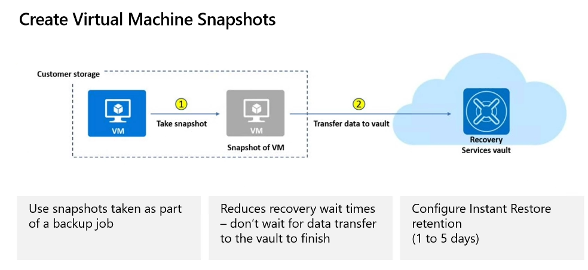
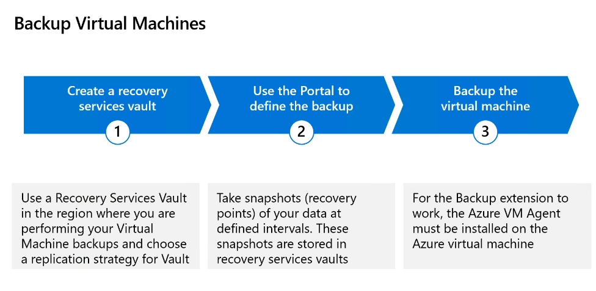

**Azure VM Agent must be installed for the backup agent to work**
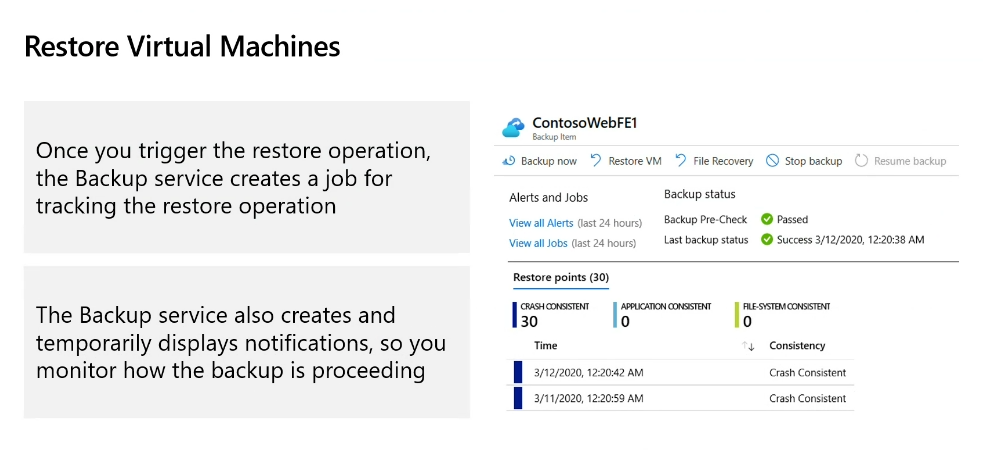

### Azure Backup Server
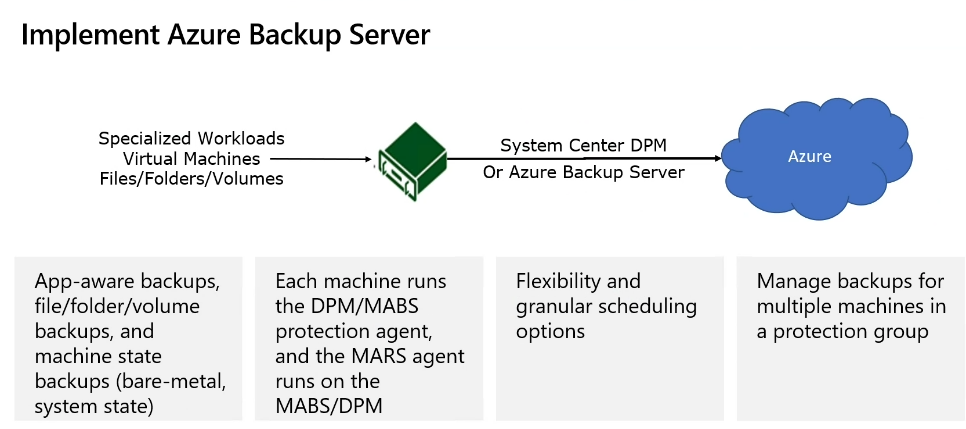

### MARS vs MABS
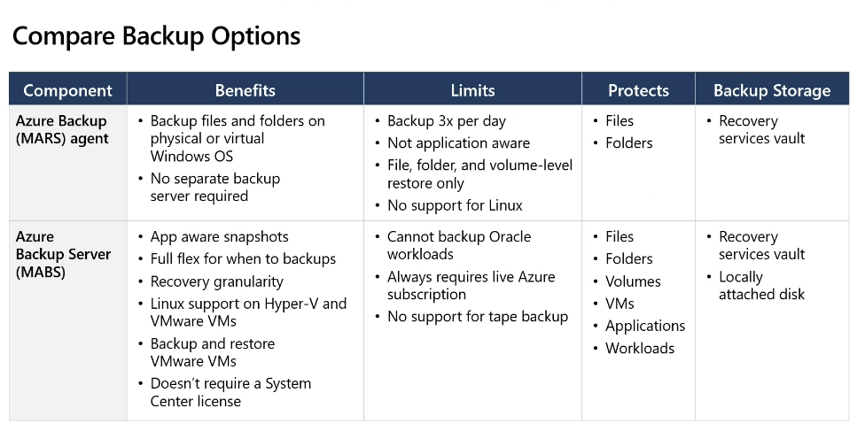

### Manage Soft Deletes
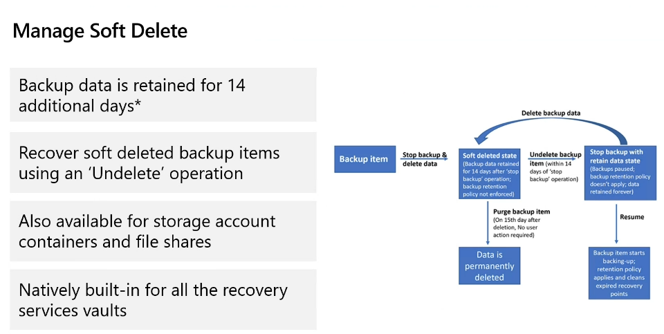

Storage Account > Data protection > Enable soft delete for blobs: (defaults to 7) it can not exceed 365 days

Recovery Service Vault > Properties > Soft Delete Settings (Default is 14 days - Free, 180 days is max and you have to pay for any days after the 14 free ones)

Cross subscription Restore: Ability to restore in different subscriptions (default enabled)

Cross Region Restore: Alow you to restore into another region for business continuity (Default disabled)

### Site recovery
- Replicate Azure VM from one Azure region to another
- Replicate on-premises VMware VMs, Hyper-V VMs, Physical servers (Windows and Linux), Azure Stack VMs to Azure
- Replicate AWS Windows instances to Azure
- Replicate on-premies VMware VMs, Hyper-V VMs managed by System Center VMM, and physical servers to a secondary site.

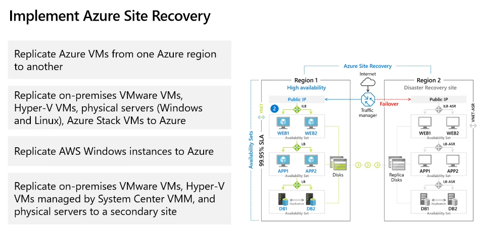

## Monitoring
### Azure Monitor
- Core Monitoring for Azure services
- Collects metrics, activity logs and diagnostic logs
- Us
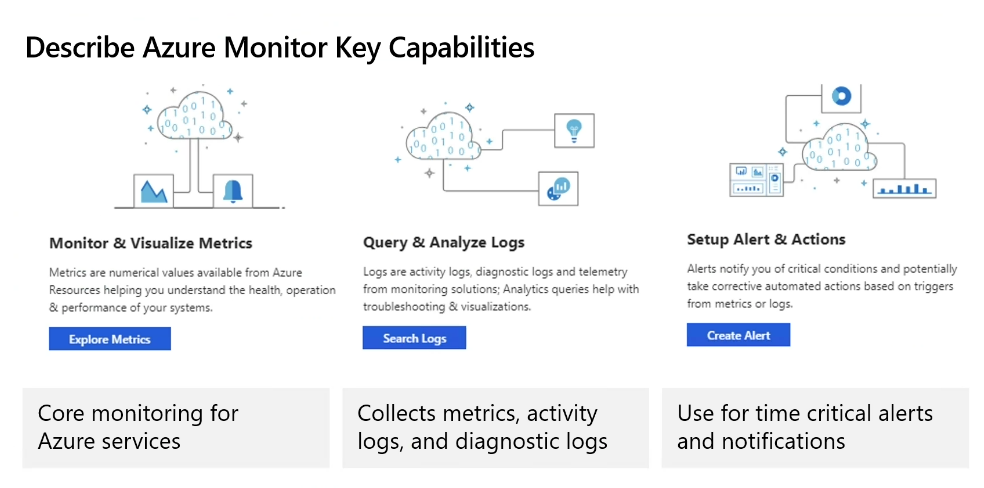

#### Azure Monitor Components
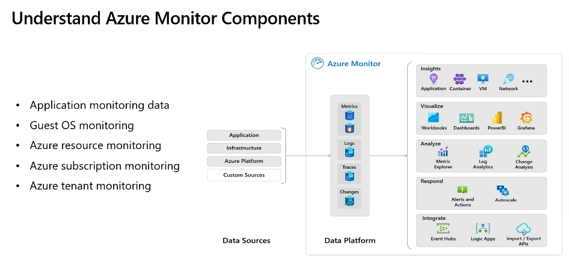

#### Define Metric Logs
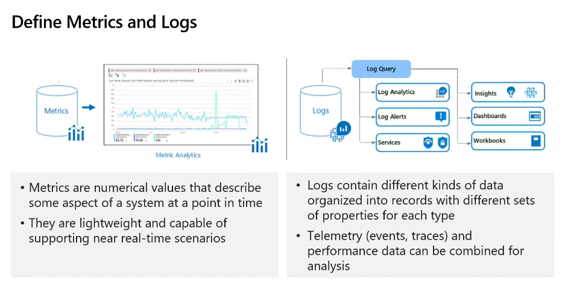

#### Activity Log Events
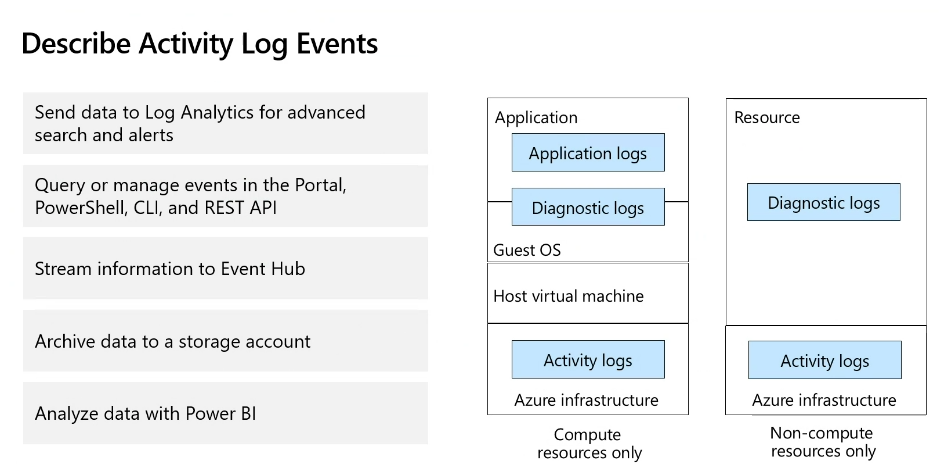

### Alerts
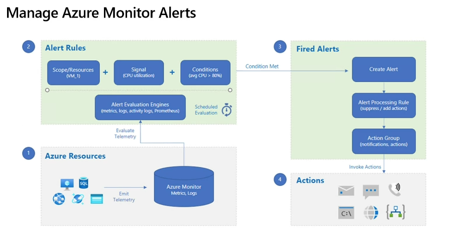
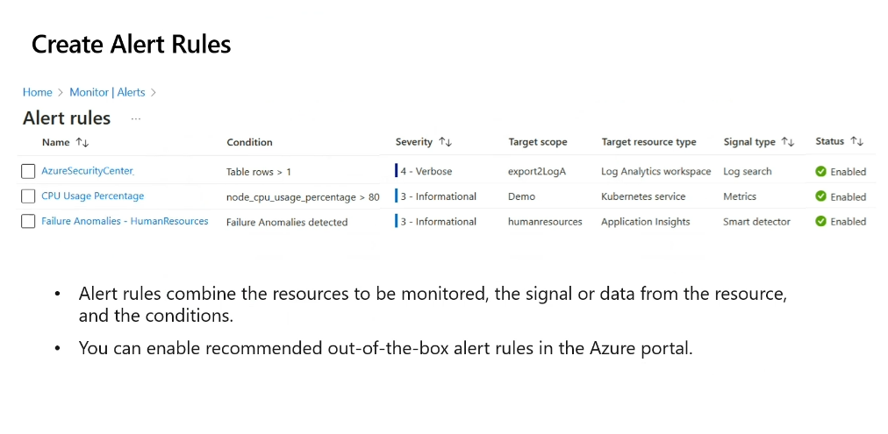
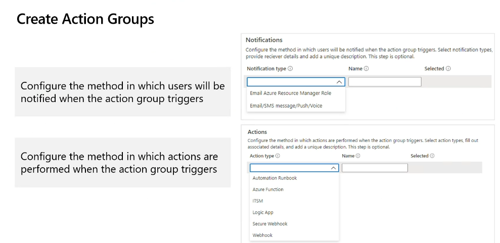

### Log Analytics
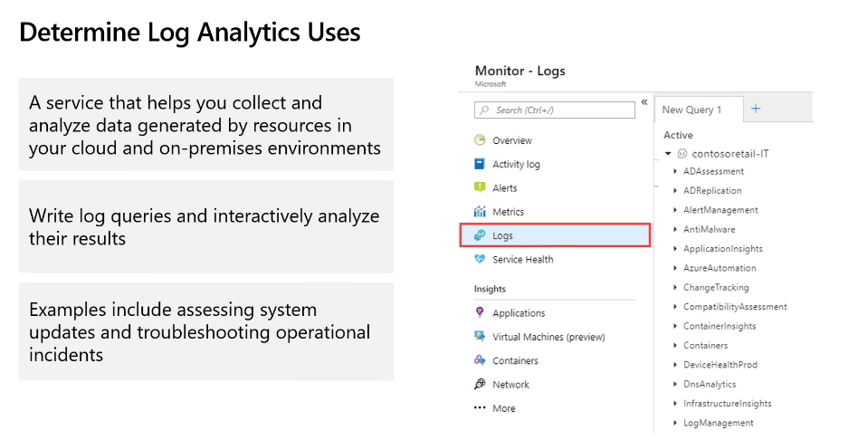

#### Workspace
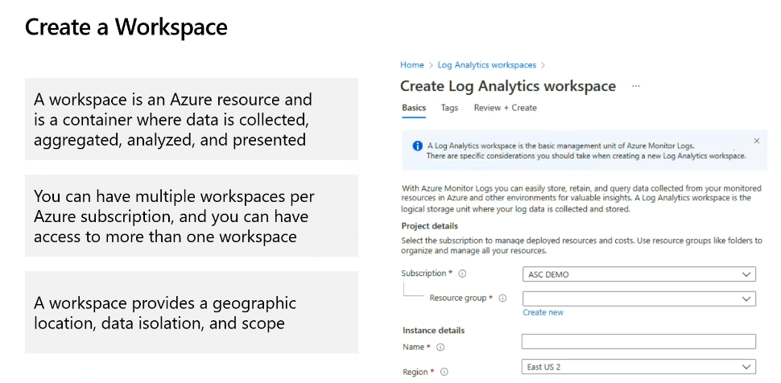

#### Query Log Analytics Data
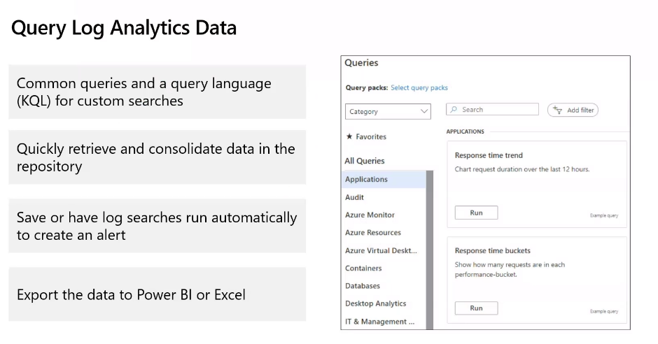

##### KQL Kusto Query Language

**Kusto Query Language (KQL)** is a powerful query language used for querying large datasets, especially within Azure Monitor Logs, Azure Data Explorer, and similar services. Here are some key points about KQL:

### Key Features of KQL:
- **Easy to Read**: KQL is designed to be both expressive and intuitive, making it easier to write and understand queries.
- **High Performance**: Optimized for performance, KQL can efficiently query large datasets and return results quickly.
- **Rich Functionality**: It supports a wide range of operators and functions, including filtering, aggregation, and joining data from multiple tables.
- **Visualization**: You can directly create charts and graphs from KQL queries to visualize your data.

### Example KQL Queries:

1. **Basic Query**:
   ```kql
   // Get the top 10 rows from a table
   MyTable
   | take 10

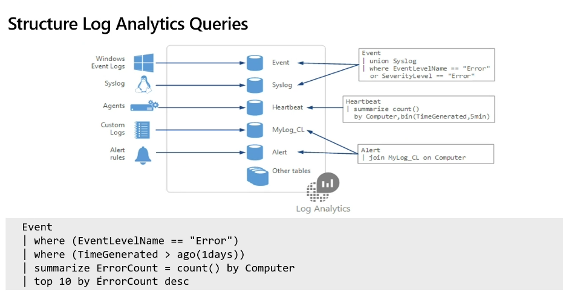

https://learn.microsoft.com/en-us/kusto/query/kql-quick-reference?view=azure-data-explorer&preserve-view=true
